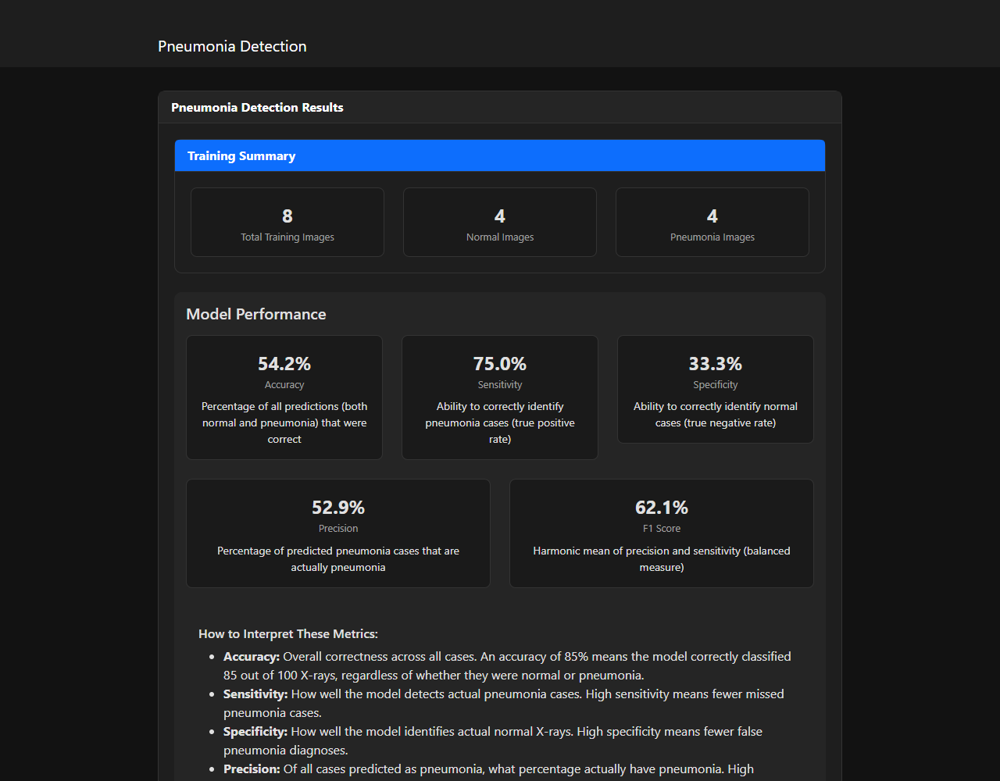
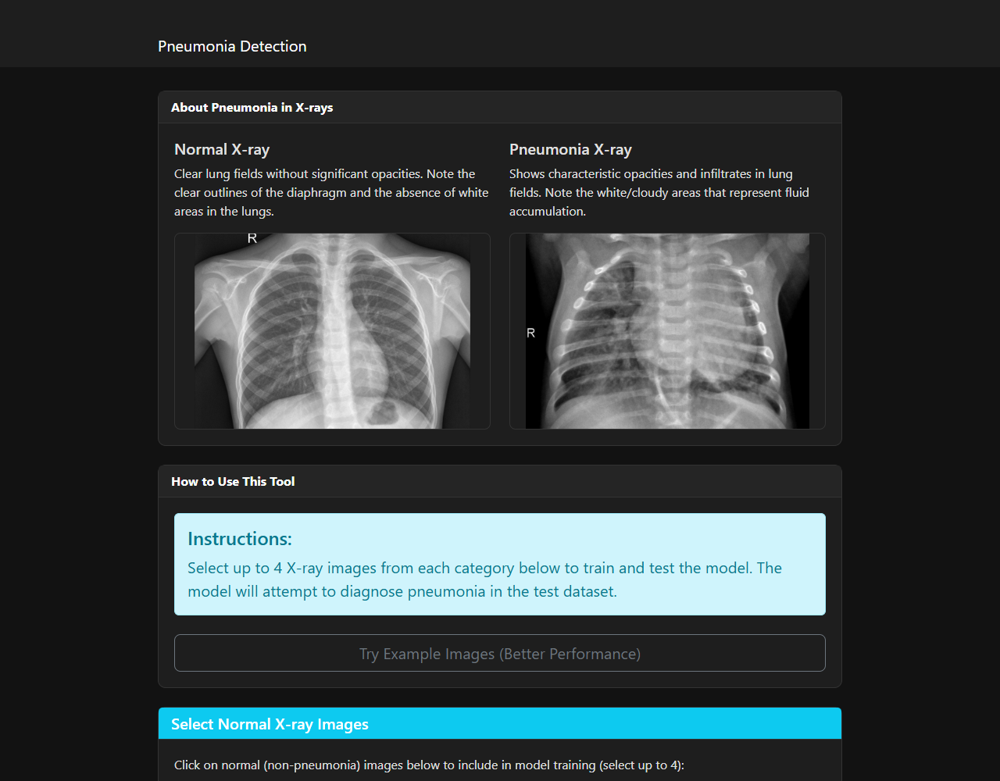
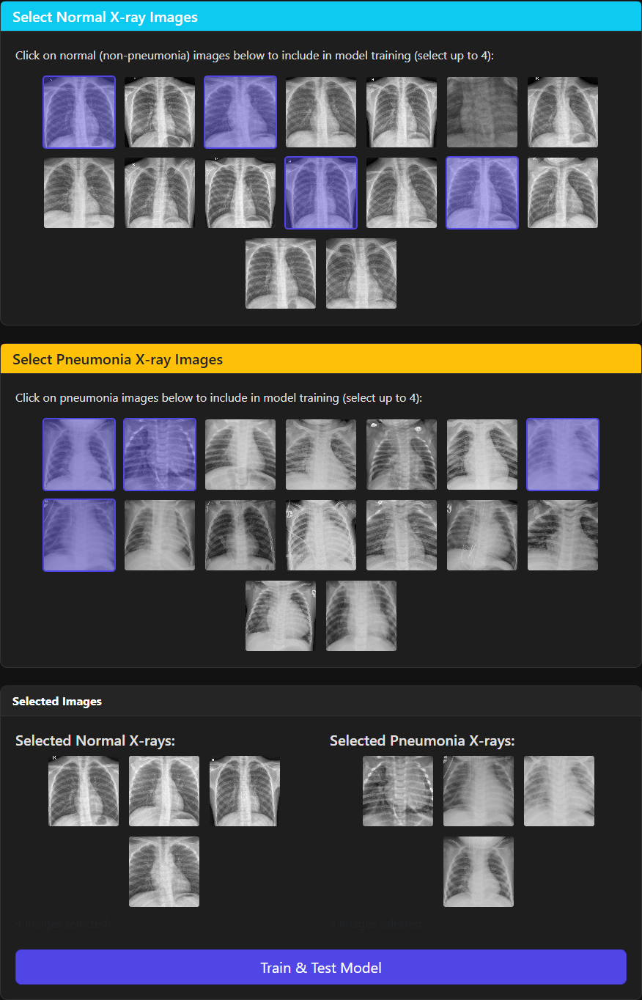
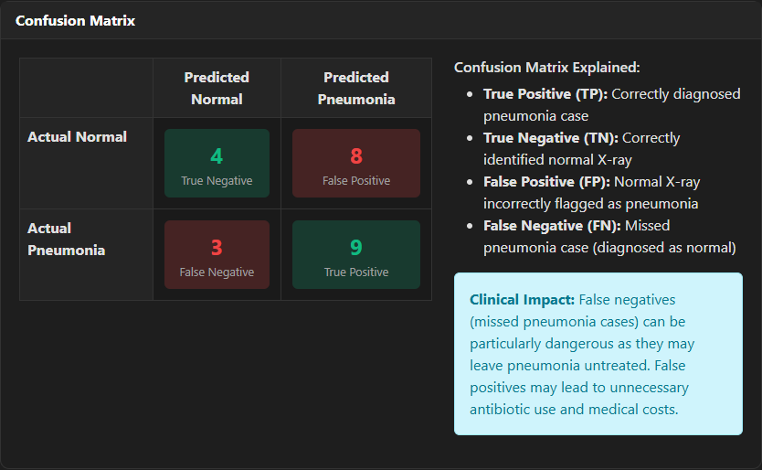
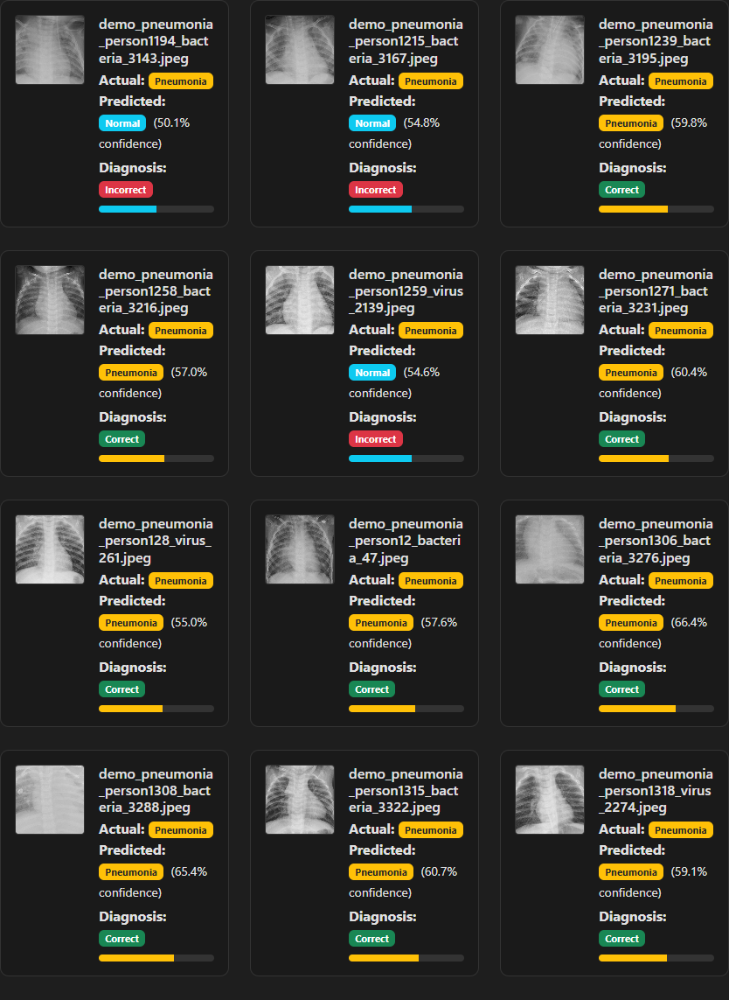
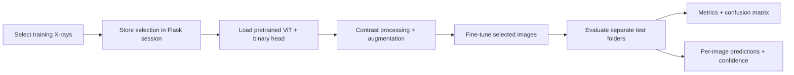

# Pneumonia Detection App

**Select chest X-rays, fine-tune a Vision Transformer, and explore where its predictions succeed—and where they fail.**

A Python/Flask machine-learning experiment that makes the training-to-evaluation loop visible. Choose a small set of normal and pneumonia-labelled X-rays, run transfer learning, and inspect aggregate metrics alongside individual predictions, confidence scores, and a confusion matrix.

Built with **Flask · PyTorch · Hugging Face Transformers · OpenCV · Bootstrap**.

This is an educational classification prototype, not a clinically validated diagnostic system.



*Actual local run: 8 selected training images, 8 training epochs, and 24 separate evaluation images from a bundled-image demo subset. The displayed results belong to that small experiment.*

## What you can do

- **Build a training selection visually:** browse normal and pneumonia X-ray grids, select up to four images per category, and review the selection before training.
- **Run a real transfer-learning experiment:** load an ImageNet-pretrained ViT, replace its classification head, and fine-tune it for `NORMAL` versus `PNEUMONIA`.
- **Explore five evaluation metrics:** accuracy, sensitivity/recall, specificity, precision, and F1.
- **Inspect the mistakes:** use the confusion matrix and filter individual results by class, correct predictions, or incorrect predictions.
- **Compare prediction confidence:** see the predicted class, softmax confidence, and actual dataset label for each evaluation image.

## In action

### 1. Explore the X-rays

The landing page introduces the two categories and explains the experiment.



### 2. Choose the training images

Selected images are highlighted in the grids and collected into a preview. This capture shows four images from each category, ready to submit.



### 3. Understand the outcomes

The confusion matrix distinguishes correctly classified images from false positives and false negatives. The results tabs connect those totals back to individual X-rays.



### 4. Inspect individual predictions

Each result pairs the X-ray with its dataset label, predicted class, confidence score, and correctness badge. The example below includes both correct predictions and missed pneumonia cases, making the model's behavior visible beyond a single accuracy number.



[Screenshot details and reproduction instructions](docs/SCREENSHOTS.md)

## Quick start

Use **Python 3.11** for the pinned dependency set. The instructions below were verified on Windows with Python 3.11.9 and CPU-only execution.

### Windows / PowerShell

```powershell
git clone https://github.com/Dobbes/pnemunia_detection_app.git
cd pnemunia_detection_app
py -3.11 -m venv .venv
.\.venv\Scripts\python.exe -m pip install -r requirements.txt
.\.venv\Scripts\python.exe scripts/prepare_demo_dataset.py
.\.venv\Scripts\python.exe -m flask --app app run --host 127.0.0.1 --port 5000
```

### macOS / Linux

```bash
git clone https://github.com/Dobbes/pnemunia_detection_app.git
cd pnemunia_detection_app
python3.11 -m venv .venv
source .venv/bin/activate
python -m pip install -r requirements.txt
python scripts/prepare_demo_dataset.py
python -m flask --app app run --host 127.0.0.1 --port 5000
```

The macOS/Linux commands use the same project layout; those platforms have not been verified in the documented screenshot run.

Open **http://127.0.0.1:5000**, select images from both categories, and click **Train & Test Model**. The first experiment downloads model files from Hugging Face; later requests reuse the download cache. Training runs synchronously, so the browser waits while the model trains and evaluates. Stop the server with **Ctrl+C**.

Run commands from the repository root: the app's dataset and static paths are relative to the working directory.

## Dataset setup

The quick-start preparation script uses JPEGs already committed in `static/dataset/`. It creates:

```text
chest_xray/
├── train/
│   ├── NORMAL/       # 16 demo candidates
│   └── PNEUMONIA/    # 16 demo candidates
├── test/
│   ├── NORMAL/       # 12 evaluation images
│   └── PNEUMONIA/    # 12 evaluation images
└── demo-manifest.json
```

It chooses one image per filename-derived patient ID, keeps those IDs separate between training and evaluation, and creates the two example images referenced by the homepage. Existing `chest_xray/` directories are left intact: the script exits instead of overwriting them.

**This is a small UI demonstration split, not the original dataset's official train/test split.** Its labels come from the bundled filenames. A real dataset can use the same directory structure; the app evaluates at most 30 images per test category. See [data and model details](docs/TECHNICAL_GUIDE.md) for naming conventions and the experimental boundaries.

## How it works



The primary checkpoint is [`google/vit-base-patch16-224`](https://huggingface.co/google/vit-base-patch16-224), pretrained on ImageNet; the two-class head is newly initialized. If loading ViT fails, the loader attempts [`microsoft/resnet-50`](https://huggingface.co/microsoft/resnet-50).

Training uses luminance histogram equalization, image augmentation, AdamW, class-weighted cross-entropy when both filename-based classes are present, learning-rate scheduling, and early stopping. Each experiment starts from the pretrained checkpoint. Fine-tuned weights are not saved, and result records remain in process memory until the server stops.

## Project layout

| Path | Responsibility |
| --- | --- |
| `app.py` | Flask routes, image selection/upload handling, training/evaluation orchestration, result cache |
| `model_helper.py` | Model loading, preprocessing, augmentation, fine-tuning, prediction helpers |
| `templates/` | Selection interface, metric explanations, confusion matrix, result tabs |
| `static/dataset/` | Bundled X-rays and generated browser-visible image copies |
| `static/images/examples/` | Four bundled examples used by the example-mode route |
| `scripts/prepare_demo_dataset.py` | Prepare a documented local subset from bundled images |
| `scripts/capture_screenshots.py` | Exercise the real browser workflow and capture documentation images |
| `docs/` | Screenshots, capture record, technical guide |
| `tests/` | Results-page regression checks; no model download required |

## Verification

```powershell
.\.venv\Scripts\python.exe -m pip check
.\.venv\Scripts\python.exe -m unittest discover -s tests -v
.\.venv\Scripts\python.exe scripts/verify_documentation.py
```

The screenshot workflow additionally runs real training and inference, checks the training/evaluation counts and confusion-matrix totals, verifies all five result tabs, and confirms every displayed X-ray loads. See [the capture record](docs/SCREENSHOTS.md) for the environment and measured demo results.

## Further reading

- [Technical guide: model, data conventions, routes, and troubleshooting](docs/TECHNICAL_GUIDE.md)
- [Screenshot gallery and how to reproduce it](docs/SCREENSHOTS.md)
- [Original Chest X-Ray Images (Pneumonia) dataset on Kaggle](https://www.kaggle.com/datasets/paultimothymooney/chest-xray-pneumonia)

The bundled filenames follow that dataset's conventions, but this repository does not include an original dataset provenance or license manifest. Refer to the source dataset for its terms and attribution; the quick-start script does not download or redistribute additional images.
